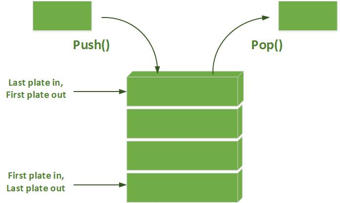

# Introduction
push_swap is a sorting algorithm project designed to sort a stack of integers using a limited set of operations on two stacks. The goal of the project is to implement an efficient algorithm that sorts numbers using the least number of moves possible.

In this implementation, a proximity-based sorting algorithm is employed to handle small sets of numbers (like 10 or 100), achieving minimal operations in both best and worst-case scenarios. It tests not only sorting efficiency but also algorithmic logic and performance under constraints.

## What are stacks?
A stack is a fundamental data structure in computer science that operates on a Last In, First Out (LIFO) principle. This means that the last element added to the stack is the first one to be removed. This only adds a little bit of complexity to the projects due the constraints.

.

Source:
[infocodify](https://www.infocodify.com/c-programming/stack).

# Instalation
`git clone https://github.com/Welepy-dev/push_swap.git`.

`cd push_swap`.

`make`.

# Usage
You can check the number of operations with this command:

`ARG=($(shuf -i 1-100)) ; ./push_swap $ARG | wc -l`.

You can also use this command to use this cool visualizer courtesy of [@gecarval](https://github.com/gecarval).

`ARG=($(shuf -i 1-100)) ; ./push_swap $ARG > ./push_swap_visualizer/result.txt ; ./push_swap_visualizer/push_swap_visualizer $ARG`.

This command writes every command to a txt file called result, you can then use: 

`cat ./push_swap_visualizer/result.txt | wc -l` to display the number of operations.

# Explanation
As you read before, this project has a lot of constraints such as using stacks. another constraint is that we are limited to use certain commands to finish this project.

The commands are:

`sa` (swap a): Swap the first 2 elements at the top of the stack a. Does nothing if there is only one or if the stack is empty.
`sb` (swap b): Swap the first 2 elements at the top of the stack b. Does nothing if there is only one or if the stack is empty.
<table>
  <tr>
    <td>

### Swap A

    </td>
    <td>
### Swap B

    </td>
  </tr>
</table>

`pa` (push a): Takes the first element on top of stack b and puts it on stack a. Does nothing if stack b is empty or if stack a is full.

`pb` (push b): Takes the first element on top of stack a and puts it on stack b. Does nothing if stack a is empty or if stack b is full.

<table>
  <tr>
    <td>

### Push A

    </td>
    <td>
### Push B

    </td>
  </tr>
</table>

`ra` (rotate a): Shifts all the elements of the stack stack a up by one position. The first element becomes the last, does nothing if stack a is empty. 

`rb` (rotate b) : Shifts all the elements of the stack b one position upwards. The first element becomes the last one, does nothing if stack b is empty. 

<table>
  <tr>
    <td>

### Rotate A

    </td>
    <td>
### Rotate B

    </td>
  </tr>
</table>

`rra` (reverse rotate a): Shifts all elements of the stack a down one position. The last element becomes the first, does nothing if stack a is empty. 

`rrb` (reverse rotate b): Shifts all the elements of the stack b one position downwards. The last element becomes the first, does nothing if stack b is empty. 

<table>
  <tr>
    <td>

### Reverse Rotate A

    </td>
    <td>
### Reverse Rotate B

    </td>
  </tr>
</table>

And then, we have operations that changes both stacks, do mind that this every single one of these count only as one operation

`ss` : Does `sa` and `sb` at the same time. 

`rr` : `ra` and `rb` at the same time. 

`rrr` : `rra` and `rrb` at the same time.

<table>
  <tr>
    <td>

### Swap Both

    </td>
    <td>
### Rotate Both

    </td>
    <td>
### Reverse Rotate Both

    </td>
  </tr>
</table>

